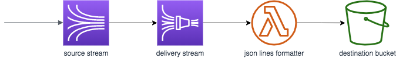

# sls-kinesis-firehose-s3

Kinesis to Firehose to S3 using the serverless framework, with a lambda transformer to write the records to individual lines in the output s3 object.



First, create the bucket by hand of name kfs3-dev-kfs3-destination, then deploy, e.g.

For multiregion replication try the s3-repl Jupyter notebook in the sls-sns project.

```
s3api create-bucket 
aws s3api create-bucket --bucket kfs3-destination-dev

env FIREHOSE_DESTINATION_BUCKET=kfs3-destination-dev sls deploy
```

